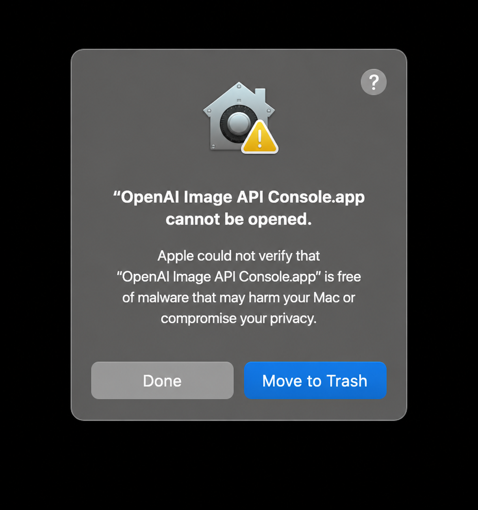
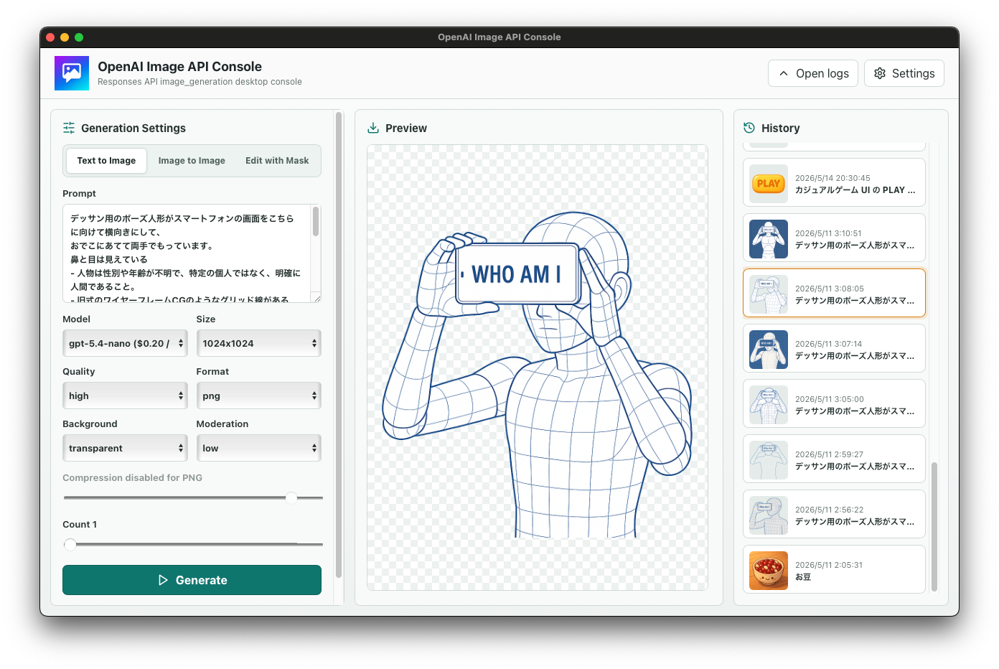
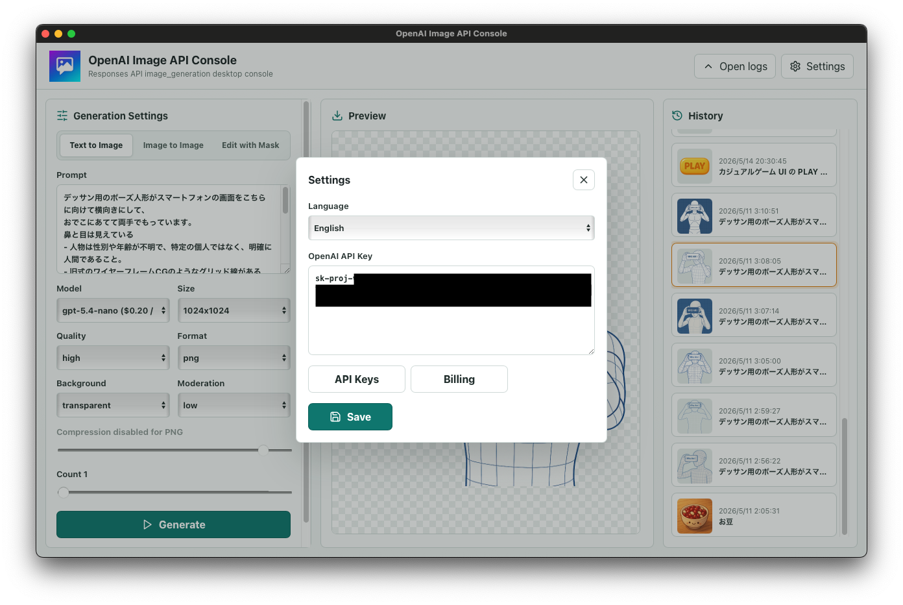
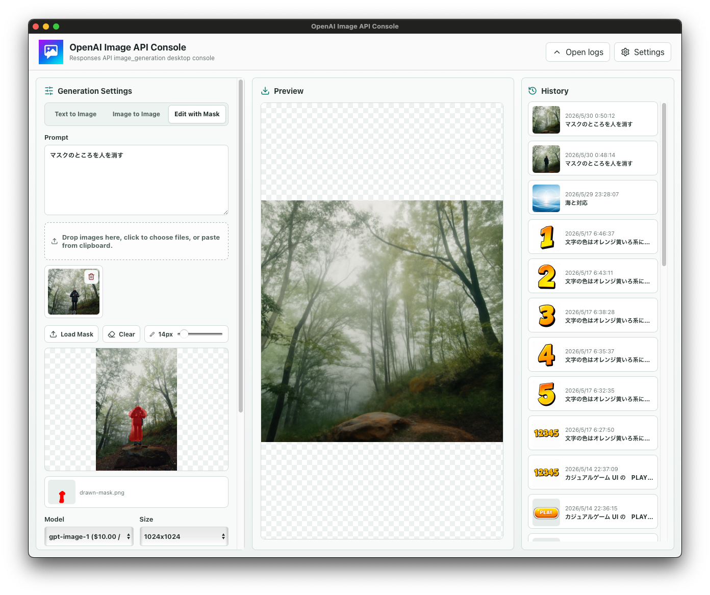

# OpenAI Image API Console

[English](README.md) | 日本語

OpenAI Image API Console は、OpenAI の画像生成・画像編集 API をデスクトップから操作するための非公式デスクトップアプリです。

テキストからの画像生成、入力画像を使った生成、マスク編集、透明 PNG 出力、モデル設定、生成履歴をローカル GUI で扱えます。Tauri + React + Vite で構成されており、macOS / Windows / Linux 向けに配布しています。

## ダウンロード

[最新版をダウンロード](https://github.com/KEDARUMA/openai-image-api-console/releases)

Releases ページでは、自分の OS に合うファイルを選んでください。

- macOS Apple Silicon: `*_aarch64.dmg`
- macOS Intel: `*_x64.dmg`
- Windows: `*_x64-setup.exe`
- Ubuntu / Debian: `*_amd64.deb`
- Fedora / RHEL: `*.x86_64.rpm`
- その他の Linux: `*_amd64.AppImage`
- `*.app.tar.gz` は通常不要

## クイックスタート

1. 自分の OS に合うリリース成果物をダウンロードします。
2. アプリを起動します。
3. 設定画面を開き、OpenAI API キーを入力します。
4. モード、モデル、サイズ、品質、背景、出力形式を選択します。
5. プロンプトや入力画像を指定して画像を生成します。

## できること

- テキストプロンプトから画像を生成
- 入力画像を使った画像生成
- アルファチャンネル付き PNG マスクによる画像編集
- 透明背景 PNG の生成
- モデル、サイズ、品質、出力形式の設定比較
- ローカル履歴から生成済み画像を確認

## 特長

- テキストからの画像生成に対応
- 入力画像を使った画像生成に対応
- マスク画像を使った画像編集に対応
- PNG / WebP / JPEG の出力形式を選択可能
- PNG の透明背景、アルファチャンネル付きマスクを扱える
- モデル選択時に料金目安を表示
- 生成履歴をローカルに保存
- 日本語 / 英語の表示切り替えに対応
- OpenAI API Keys / Billing ページを設定画面から開ける

## macOS の注意

現在の配布版は Apple Developer ID による署名や notarization を行っていません。macOS では初回起動時にセキュリティ警告が表示される場合があります。



アプリを Applications にコピーした後、この警告が表示された場合は、以下を実行して quarantine 属性を削除してから起動してください。

```bash
xattr -dr com.apple.quarantine "/Applications/OpenAI Image API Console.app"
open "/Applications/OpenAI Image API Console.app"
```

## スクリーンショット

### メイン画面



### 設定画面



### Edit with Mask



## API キー

このアプリは OpenAI API キーを使って OpenAI API にリクエストします。

API キーはローカルのアプリ設定として保存されます。公開リポジトリやスクリーンショットに API キーを含めないでください。

## 対応モデル一覧

モデル選択欄では、モデルごとの対応状況と料金情報を確認できます。

以下はプロジェクトの確認表で確認したモデル対応状況です。`✅` は対応、`❌` は非対応を示します。

| モデル ID | 系統 | Text to Image | Image to Image | Edit with Mask | アルファチャンネル対応 | 価格 |
|---|---|---|---|---|---|---|
| `gpt-image-2` | GPT Image 2 | ✅ | ✅ | ✅ | ✅ | Image: input $8.00 / cached $2.00 / output $30.00、Text: input $5.00 / cached $1.25 |
| `gpt-image-1.5` | GPT Image 1.5 | ✅ | ✅ | ✅ | ✅ | Image: input $8.00 / cached $2.00 / output $32.00、Text: input $5.00 / cached $1.25 / output $10.00 |
| `gpt-image-1` | GPT Image 1 | ✅ | ✅ | ✅ | ✅ | アプリ表示: input $10.00 / output $40.00 |
| `gpt-image-1-mini` | GPT Image 1 mini | ✅ | ✅ | ✅ | ✅ | Image: input $2.50 / cached $0.25 / output $8.00、Text: input $2.00 / cached $0.20 |
| `chatgpt-image-latest` | ChatGPT Image | ✅ | ✅ | ✅ | ✅ | アプリ表示: input $8.00 / output $32.00 |
| `gpt-5.5` | GPT-5.5 | ✅ | ✅ | ✅ | ❌ | Standard short context: input $5.00 / cached $0.50 / output $30.00 |
| `gpt-5.4` | GPT-5.4 | ✅ | ✅ | ✅ | ❌ | Standard short context: input $2.50 / cached $0.25 / output $15.00 |
| `gpt-5.2` | GPT-5.2 | ✅ | ✅ | ✅ | ❌ | アプリ表示: input $1.75 / output $14.00 |
| `gpt-5.4-mini` | GPT-5.4 mini | ✅ | ✅ | ✅ | ❌ | Standard short context: input $0.75 / cached $0.075 / output $4.50 |
| `gpt-5.4-nano` | GPT-5.4 nano | ✅ | ✅ | ✅ | ❌ | Standard short context: input $0.20 / cached $0.02 / output $1.25 |
| `gpt-5-nano` | GPT-5 nano | ✅ | ✅ | ✅ | ❌ | アプリ表示: input $0.05 / output $0.40 |

公式価格で明確に確認できた画像生成モデルは、特に `gpt-image-2` / `gpt-image-1.5` / `gpt-image-1-mini` です。`アプリ表示` の価格は設定ファイル内の表示値です。

表示される価格は設定ファイルに含まれる目安です。実際の料金、利用可能モデル、課金条件は OpenAI の公式価格情報と Billing ページで確認してください。

## 透明 PNG とマスク

出力形式に PNG を選択し、背景に `transparent` を指定すると、透明背景の画像生成に利用できます。

マスク編集では、API に渡すマスク画像としてアルファチャンネル付き PNG を扱います。透明部分を編集対象、不透明部分を保護対象として使う用途を想定しています。

## 注意事項

- このアプリは OpenAI 公式アプリではありません。
- API の利用には OpenAI API キーと有効な課金設定が必要です。
- 生成結果や利用料金は、指定したモデル、品質、サイズ、入力内容、OpenAI 側の仕様変更によって変わる可能性があります。
- 秘匿情報を含むファイルを公開リポジトリへ含めないでください。

## 開発

### 必要環境

- Node.js
- npm
- Rust / Cargo
- Tauri のビルドに必要な OS 別依存関係

OS ごとの Tauri ビルド要件は、Tauri 公式ドキュメントを確認してください。

### セットアップ

依存関係をインストールします。

```bash
npm install
```

### ローカル起動

```bash
npm run tauri:dev
```

フロントエンドだけを確認する場合は、以下でも起動できます。

```bash
npm run dev
```

### ビルド

配布用アプリをビルドします。

```bash
npm run tauri:build
```

Tauri はビルド前に `npm run build` を実行し、生成された `dist/` をアプリに組み込みます。

## ライセンス

MIT License
